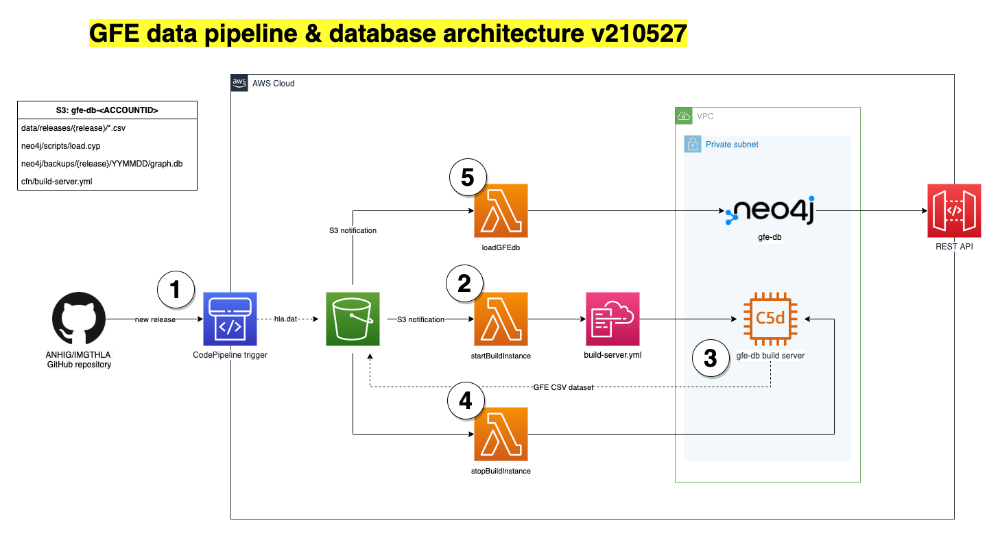

gfe-db-update-service
=====================

Infrastructure for updates to `gfe-db`.

## Table of Contents
<!-- Comment out lines to remove them from the TOC. Uncomment them and save the document to update the TOC. -->
- [gfe-db-update-service](#gfe-db-update-service)
  - [Table of Contents](#table-of-contents)
  - [Project Structure](#project-structure)
  - [Description](#description)
    - [Architecture](#architecture)
    - [CloudFormation Templates](#cloudformation-templates)
      - [`build-service.yml`](#build-serviceyml)
  - [Installation](#installation)
    - [Prerequisites](#prerequisites)
    - [Creating a Python Virtual Environment](#creating-a-python-virtual-environment)
      - [Adding a kernel spec to Jupyter Notebook](#adding-a-kernel-spec-to-jupyter-notebook)
    - [Environment Variables](#environment-variables)
    - [Additional Instructions](#additional-instructions)
  - [Usage](#usage)
  - [Running Tests](#running-tests)
  - [Deployment](#deployment)
  - [Clean Up](#clean-up)
  - [Authors](#authors)
  - [References & Links](#references--links)

## Project Structure 
```
.
├── README.md
├── cfn
│   └── build-service.yml                       # Deploys the build server and EBS volume
└── img
```

## Description
This service ingests quarterly updates to the IPD-IMGT/HLA database into a data pipeline hosted on AWS where it builds a dataset of CSV files using Gene Feature Enumeration. The data is then loaded into a running instance of Neo4j for queries and visualization.

### Architecture
1. New release triggers a CodePipeline webhook that loads the newest `hla.dat` file into an S3 bucket.
2. An S3 notification triggers a Lambda that creates a CloudFormation stack that deploys an EC2 instance, EBS volume and security group.
3. The build server downloads and parses the data to create a set of CSV files that describe GFEs and their relationships. The CSVs are stored as artifacts in S3.
4. An S3 notification triggers a Lambda to terminate the build server and delete the EBS volume.
5. Another S3 notification triggers a Lambda to update Neo4j from the newly created CSV files.


### CloudFormation Templates

#### `build-service.yml`
Deploys an EC2, EBS volume and security group. The EC2 instance downloads data from https://github.com/ANHIG/IMGTHLA, builds a set of CSVs for the given release, and stores them in S3. A Lambda function destroys the instance and EBS volume when the build is complete.

To deploy, run the command.
```bash
aws cloudformation deploy \
  --template-file cfn/build-service.yml \
  --stack-name gfe-db-update-build
```

To delete, run the command.
```bash
aws cloudformation delete-stack \
  --stack-name gfe-db-update-build
```

## Installation

### Prerequisites
* Python 3.8
* AWS CLI

### Creating a Python Virtual Environment
Run these commands to create a virtual environment that will install the libraries listed in `requirements.txt`.
```bash
# Create .venv and activate
python3 -m venv .venv
source .venv/bin/activate

# Update pip to avoid conflicts
pip install -U pip

# Install libraries
pip install -r requirements.txt
```

To save requirements, run the command.
```bash
pip freeze > requirements.txt
```

#### Adding a kernel spec to Jupyter Notebook
To use the virtual environment inside Jupyter Notebook it is necessary to create a kernel.
```bash
# Install ipykernal
pip install ipykernel

# Add the kernel
python3 -m ipykernel install \
  --user \
  --name gfe-update-service \
  --display-name gfe-update-service
```

To remove the kernel spec, run the command.
```bash
jupyter kernelspec uninstall gfe-update-service
```

### Environment Variables
```bash
# Example of how to format environment variables in .env
VARIABLE1=<value>
VARIABLE2=<value>
VARIABLE3=<value>
```

*Important:* Always use a `.env` file or AWS SSM Parameter Store for sensitive variables like credentials and API keys. Never hard-code them, including when developing. AWS will quarantine an account if any credentials get accidentally exposed and this will cause problems.

### Additional Instructions
*Include additional instructions for creating the environment the application needs.*

## Usage
The next section is usage, in which you instruct other people on how to use your project after they’ve installed it and created the environment. This is where code blocks `docker run`, `python3 my_script.py`, or `bash run.sh` can go. Make sure to describe what the step is and give the command.

```bash
# Example usage
python3 my_script.py
```

## Running Tests
Include code blocks to show how to test the project.

## Deployment
Include instructions for deployment to AWS.

## Clean Up
*Include code blocks that show how to tear down the project. This is important for developers working on their local machine with tools like Docker, or for tearing cloud infrastructure used for development.*

## Authors
List developers who have contributed to the repository. Make sure to update for if personnel change.

**Primary Contact:** Gregory Lindsey ([@abk7777](https://github.com/abk7777)) \
**Contributor:** First name Last name ([@username](https://github.com/username))

## References & Links
* This information was originally found in [GitHub Guides](https://guides.github.com/features/wikis/).
* More examples of [GitHub markdown](https://gist.github.com/stevenyap/7038119)

-----------------
<br>
<p align="center">
  
</p>